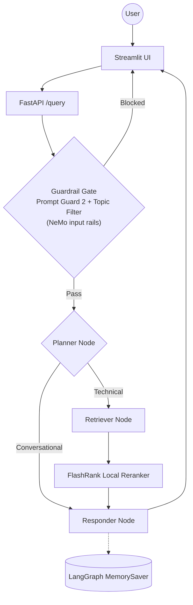

# Enterprise Agentic RAG (Scalable Pipeline)

A production-grade, enterprise-level RAG system built with **LangGraph**, a **Portkey LLM Gateway**, and a layered **guardrail stack**. The system distinguishes technical "True Data" from random "Noisy Data" using semantic re-ranking and history-aware planning, and is measured by a RAGAS evaluation suite scored by an independent judge model.

## Key Features

- **Agentic Intelligence**: LangGraph for cyclic reasoning, multi-step planning, and conversation memory.
- **Layered Guardrails**: NeMo Guardrails *input rails* wrapping a dedicated Llama Prompt Guard 2 injection classifier and a scoped topical filter, plus hardened system prompts as defence-in-depth. Blocked messages never reach retrieval or generation.
- **Model Tiering**: Each guardrail layer runs on a small model with its own rate-limit budget (~50-200 tokens/check), so gate checks never starve 70B answer generation.
- **LLM Gateway**: Portkey routes all generation calls with automatic fallback, semantic caching, and retry across Groq models.
- **Enterprise Search**: Qdrant Cloud vector search + FlashRank cross-encoder reranking (local, zero-latency).
- **Local Embeddings**: `all-mpnet-base-v2` sentence-transformers (768-dim), run on-device — no embedding API dependency or quota.
- **Local Document Parsing**: PDF, HTML, TXT, DOCX, PPTX parsed entirely on-device — no external OCR service.
- **Observability**: Full trace nesting with **Pydantic Logfire** and **LangSmith** across every agent node.
- **Evaluation Suite**: RAGAS pipeline (6 metrics) judged by an independent model family, plus a precision/recall harness for the guardrail layer.

---

## Agent Intelligence Flow



---

## Project Structure

```text
├── app/
│   ├── agents/
│   │   └── nodes/       # Planner, Retriever, Responder LangGraph nodes
│   ├── gateway/         # Portkey LLM gateway — primary + fallback Groq routing
│   ├── guardrails/      # Layered gate: Prompt Guard 2 + topic filter behind NeMo input rails
│   ├── ingestion/
│   │   ├── chunking/    # Paragraph-based text splitter (1500 char max)
│   │   └── loaders/     # Local parsers — PDF (pypdf), HTML, TXT, DOCX, PPTX
│   ├── services/
│   │   └── retrieval/   # Local embeddings + Qdrant search + FlashRank reranking
│   ├── config.py        # Centralized environment variable management
│   └── main.py          # FastAPI entrypoint — guardrails gate + /query endpoint
├── evals/               # RAGAS evaluation suite + Streamlit 3-tab demo
├── ui/                  # Streamlit chat interface with reasoning step transparency
├── processed_data/      # Auto-generated — parsed & chunked JSON output per document
├── DOCS/                # Architectural and operational guides (11 docs)
├── DATA/                # Sample datasets (True vs Noisy documentation)
└── requirements.txt     # Pinned dependencies
```

---

## Tech Stack

| Layer | Technology |
|-------|-----------|
| Orchestration | LangChain + LangGraph |
| Generation LLM | Groq (Llama 3.3 70B) via **Portkey** gateway |
| Guardrails | NeMo Guardrails (input rails) + Llama Prompt Guard 2 + scoped topic filter |
| Vector DB | Qdrant Cloud |
| Reranking | FlashRank cross-encoder (local, zero-latency) |
| Embeddings | `all-mpnet-base-v2` sentence-transformers (768-dim, local) |
| Document Parsing | pypdf + pdfplumber (local, no OCR service) |
| Observability | Pydantic Logfire + LangSmith |
| Evaluation | RAGAS (judge: `openai/gpt-oss-120b`) + Tool Correctness (Jaccard) |

---

## Getting Started

### 1. Install dependencies

```powershell
python -m venv tenvv
.\tenvv\Scripts\activate
pip install -r requirements.txt
```

### 2. Configure environment

Create a `.env` file with the following keys:

```env
# Groq Reasoning Engine (Llama 3.3)
GROQ_API_KEY = ""
GROQ_FALLBACK_API_KEY = ""          # second Groq key, or same as primary

# Portkey LLM Gateway
PORTKEY_API_KEY = ""

# Qdrant Vector DB
QDRANT_API_KEY = ""
QDRANT_CLUSTER_ENDPOINT = ""        # e.g. https://your-cluster.cloud.qdrant.io:6333

# Pydantic Logfire Observability
LOGFIRE_TOKEN = ""

# LangSmith
LANGSMITH_TRACING = true
LANGSMITH_ENDPOINT = https://api.smith.langchain.com
LANGSMITH_API_KEY = ""
LANGSMITH_PROJECT = ""

# Streamlit UI → FastAPI
BACKEND_URL = "http://localhost:8000"

# Eval judge LLM. Optional — falls back to GROQ_API_KEY if unset.
# Note: Groq token budgets are enforced per *organisation*, not per key, so a
# second key from the same account does not buy extra quota. The eval suite
# instead isolates itself by judging on a different model family (gpt-oss),
# which has its own budget.
JUDGE_GROQ = ""
```

> Embeddings run locally via sentence-transformers — no embedding API key is required.

> If your Portkey workspace has `block_inline_config` enabled, also set
> `PORTKEY_CONFIG_SLUG` to a saved Portkey Config slug (`pc-...`); otherwise the
> gateway rejects the inline fallback/cache/retry config.

### 3. Run data ingestion

Parses all documents in `DATA/`, chunks them, saves metadata to `processed_data/`, and indexes vectors into Qdrant.

```powershell
python -m app.ingestion.processor DATA --wipe
```

> Pass `--wipe` to drop and recreate the Qdrant collection. Omit it to append to an existing collection.

### 4. Launch the app

```powershell
# Terminal 1 — FastAPI backend
uvicorn app.main:app --reload --port 8000

# Terminal 2 — Streamlit UI
streamlit run ui/app.py
```

### 5. Run the eval suite (optional)

```powershell
# Requires the FastAPI backend running on :8000
streamlit run evals/app.py
```

---

## Documentation Index

| # | Guide | What it covers |
|---|-------|---------------|
| 01 | [System Overview](DOCS/01_SYSTEM_OVERVIEW.md) | High-level vision and end-to-end flow |
| 02 | [Ingestion Engine](DOCS/02_INGESTION_ENGINE.md) | Document parsing and indexing pipeline |
| 03 | [Node Intelligence](DOCS/03_NODE_INTELLIGENCE.md) | Planner, Retriever, Responder internals |
| 04 | [Observability](DOCS/04_TRACING_AND_OBSERVABILITY.md) | Logfire + LangSmith tracing |
| 05 | [Environment Variables](DOCS/05_ENVIRONMENT_VARIABLES.md) | All env vars and configuration reference |
| 06 | [Known Gotchas](DOCS/06_KNOWN_GOTCHAS.md) | Non-obvious bugs and architectural decisions |
| 07 | [FlashRank Reranking](DOCS/07_FLASHRANK_RERANKING.md) | Local semantic reranker deep-dive |
| 08 | [Guardrails](DOCS/08_GUARDRAILS.md) | NeMo Guardrails implementation |
| 09 | [LLM Gateway](DOCS/09_LLM_GATEWAY.md) | Portkey routing, fallback, and observability |
| 10 | [Evals](DOCS/10_EVALS.md) | RAGAS metrics theory and token budget |
| 11 | [Evals Pipeline](DOCS/11_EVALS_PIPELINE.md) | Live eval pipeline and Streamlit demo |

---

*Built for High-Scale Enterprise Document Intelligence.*
